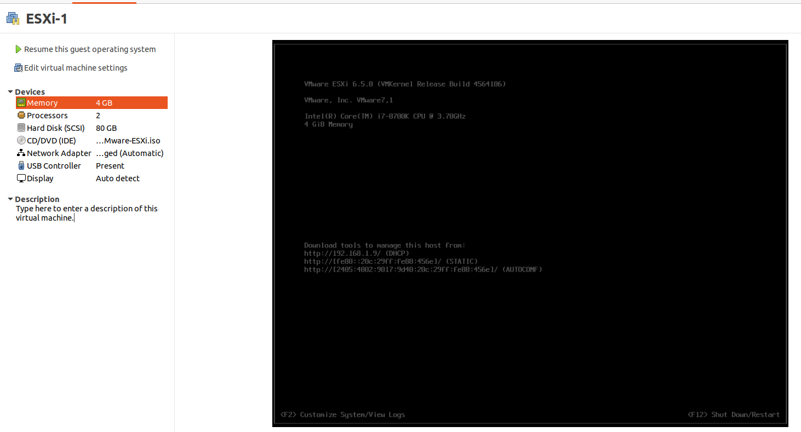

# Vcenter Setup
VCenter installation

Requirements

| Host      | Ip Address |
| ----------- | ----------- |
| ESXi-1      | 192.168.1.9       |
| ESXi-2      | 192.168.1.10        |


*<p align="center"> Ví dụ về cây phân đoạn quản lý tổng của đoạn </p>*

Fix ubuntu issue
```bash
sudo groupadd promiscuous
sudo usermod -a -G promiscuous mc
sudo chgrp promiscuous /dev/vmnet*
sudo chmod g+rw /dev/vmnet*
```